# analisis-contornos

**Guía de uso.**

**Prerrequisitos.**

- Python 3.7 o superior instalado en tu sistema

- pip (gestor de paquetes de Python)

**Instalación de dependencias.**

Abra su terminal (CMD, PowerShell, o terminal de Linux/Mac) y ejecute
los siguientes comandos:

\# Verificar que tienes Python instalado

python \--version

\# Actualizar pip (recomendado)

python -m pip install \--upgrade pip

\# Instalar todas las dependencias necesarias

pip install opencv-python

pip install pillow

pip install numpy

pip install pandas

pip install matplotlib

pip install tkinterdnd2

- OpenCV se necesita para el procesamiento de imágenes y visión por
  computadora.

- Pillow se usa en la manipulación de imágenes (PIL).

- NumPy se requiere en las operaciones numéricas y arrays.

- Pandas se usa en la manipulación y análisis de datos.

- Matplotlib se usa en la generación de gráficos y visualización.

- TkinterDnD2 se usa para la funcionalidad de arrastrar y soltar
  archivos.

**Abrir el ejecutable.**

- Opción 1: Ejecutar el archivo .exe directamente.

La aplicación viene con un ejecutable pre-compilado que no requiere
tener Python instalado.

Localice el ejecutable:

Navegue a la carpeta "dist" dentro del directorio del proyecto.

Busque el archivo "vision_gui.exe".

Ejecute la aplicación:

Método más simple: Haga doble clic en vision_gui.exe. Se le abrirá una
pantalla de consola, solo espere unos segundos hasta que se abra la
aplicación real (de color blanco principalmente).

- Opción 2: Desde terminal/CMD (opcional):

\# Abra su terminal en la carpeta "dist"

cd \<ruta/del/proyecto\>/dist

\# Ejecute el programa desde su línea de comandos

vision_gui.exe

- **Importante.**

Maximice la ventana de la aplicación a su máximo para poder observar los
resultados sin problema.

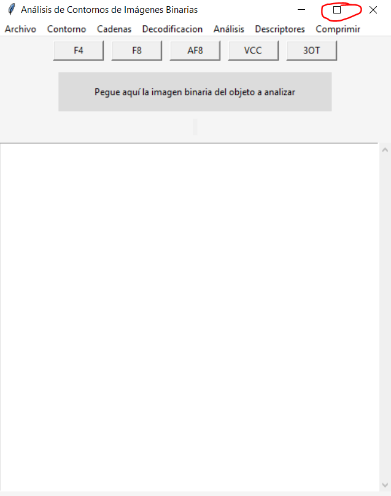{width="3.6594444444444445in"
height="4.641865704286964in"}

**Interfaz.**

La interfaz se compone de los siguientes elementos:

1.  Panel de Control (presenta más botones).

2.  Espacio para pegar imagen y botones para sacar códigos de cadena en
    directo.

3.  Cuadro de texto.

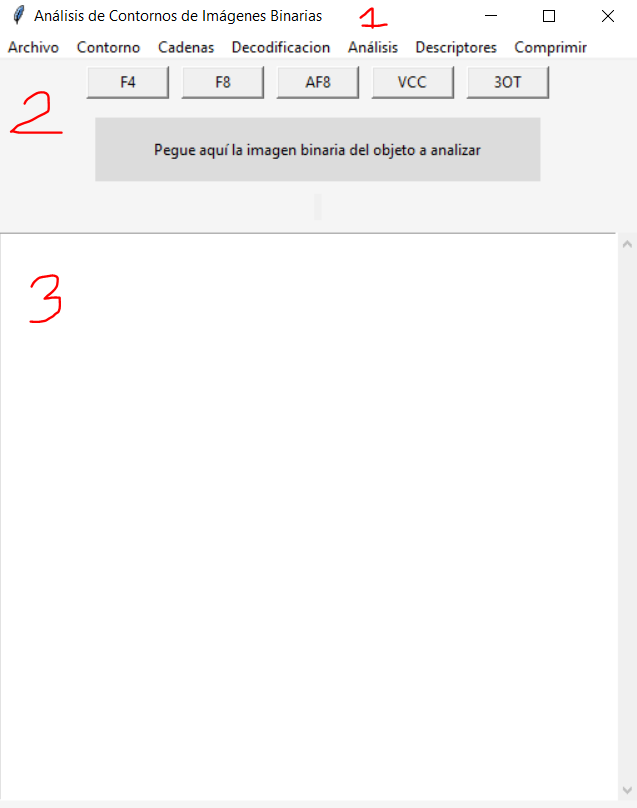{width="3.459679571303587in"
height="4.388472222222222in"}

**Panel de Control.**

En el panel de control se encuentran los siguientes botones:

1.  Archivo, donde puede seleccionar la imagen a analizar desde su
    explorador de archivo, de igual forma se puede cargar un código de
    cadena desde su archivo .txt o puede salirse de la aplicación.

2.  Contorno, donde puede observar el contorno y el punto de inicio o
    partida de la imagen binaria que se tomaron para los códigos de
    cadena.

3.  Cadenas, donde puede seleccionar el código de cadena a obtener.

4.  Decodificación, donde puede guardar el código de cadena como un
    archivo y decidir decodificarlo de nuevo en una imagen y guardarla.

5.  Análisis, donde se observan los histogramas y la entropía de
    Shannon.

6.  Descriptores, donde se observan las propiedades geométricas de la
    imagen binaria.

7.  Comprimir, donde se aplica la comprensión de Huffman y la
    comprensión Aritmética.

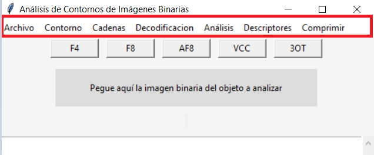{width="5.905555555555556in"
height="2.451388888888889in"}

Espacio para pegar imagen y botones para sacar códigos de cadena en
directo.

(corresponde a la parte "1. Visualización de la Imagen" y también ("2.
Código de Cadena")

Objetivo: Brindar la capacidad de pegar la imagen binaria con solo
arrastrarla del explorador de archivo y soltarla en región solicitada.
Permitir un acceso rápido para aplicar y obtener los códigos de cadena.

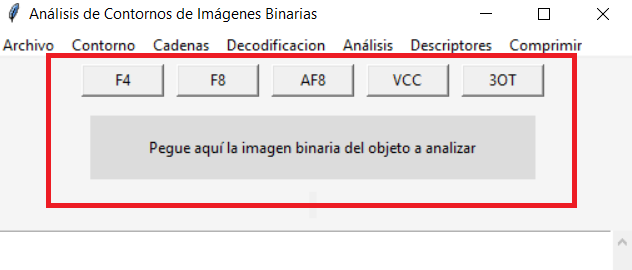{width="5.905555555555556in"
height="2.5229166666666667in"}

Descripción:

- Espacio para pegar imagen: Es una región sombreada de color gris donde
  el usuario puede soltar cualquier imagen binaria de su elección.

Paso 1: Abra su explorador de archivos.

Paso 2: Navegue en su explorador de archivos y seleccione la imagen
binaria a analizar en la aplicación.

Paso 3: Matenga seleccionada la imagen y arrástrela a la aplicación.

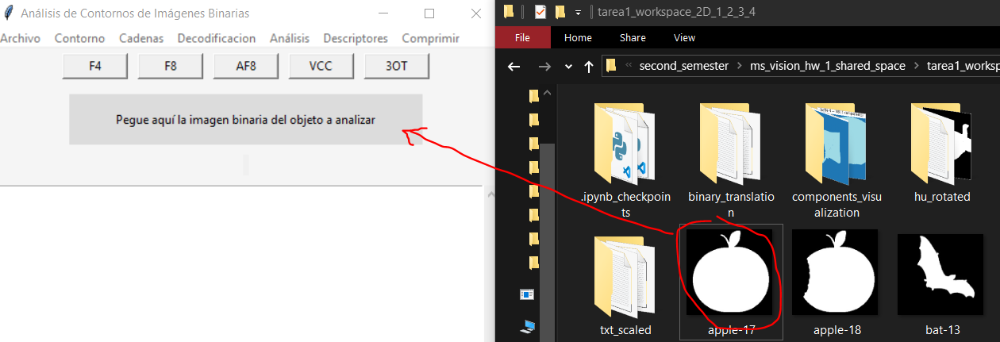{width="5.4021292650918635in"
height="1.8479297900262468in"}

Paso 4: Suelte la imagen en la región sombreada gris donde dice "Pegue
aquí la imagen binaria del objeto a analizar".

Paso 5: Se verá la imagen a analizar en la región donde se soltó.

Paso 6: El usuario puede volver a hacer lo mismo las veces que desee.
Por ello se mantiene la región grisácea.

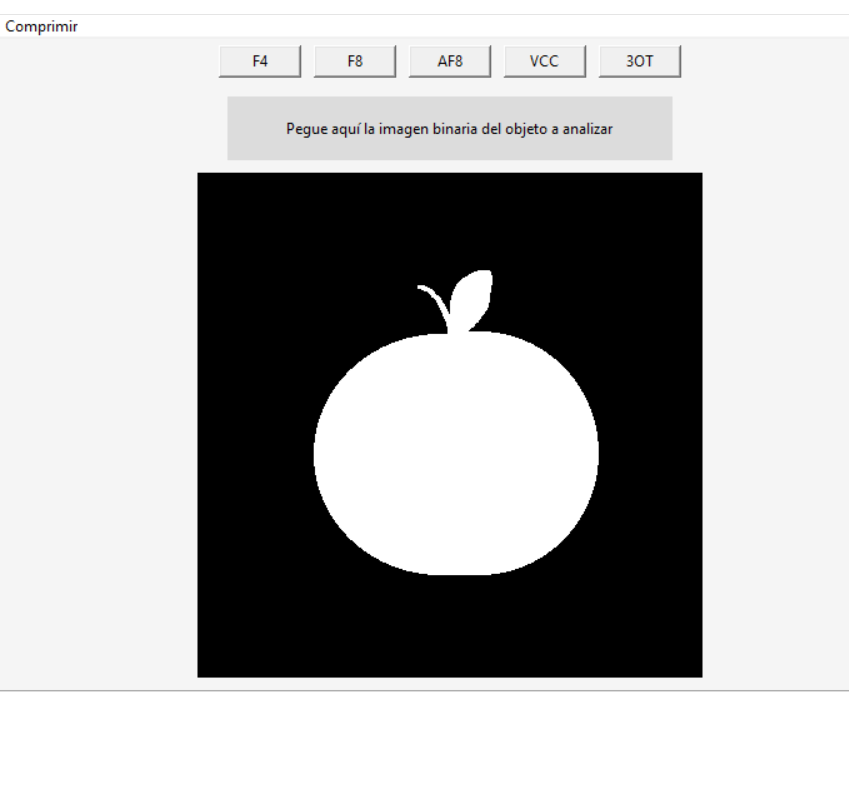{width="3.716434820647419in"
height="3.5411876640419946in"}

- Botones para sacar códigos de cadena en directo: Son botones que solo
  se pueden usar si ya hay una imagen previamente cargada en la
  aplicación. De lo contrario saldrá una alerta indicando que primero
  cargue una imagen.

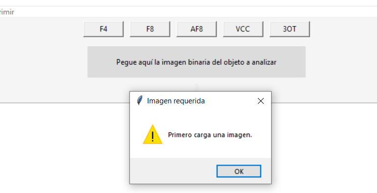{width="5.905555555555556in"
height="3.0256944444444445in"}

Estos botones permiten el acceso rápido al cálculo y generación de los
códigos de cadena según al algoritmo solicitado. Esto se debe porque
varias funciones posteriores necesitan que el usuario haya obtenido
previamente algunos códigos de cadena.

> Los botones corresponden al algoritmo que se aplica y por ende al
> código de cadena que se genera: F4, F8, AF8, VCC, 3OT.
>
> Paso 1: El usuario debe tener una imagen previamente cargada.\
> Paso 2: El usuario puede dar clic en el botón que tenga el nombre del
> algoritmo que guste aplicar.\
> Paso 3: El resultado del algoritmo, el código de cadena se verá
> reflejado como texto en el cuadro de texto inferior. Tendrá
> información de lo hecho y obtenido (nombre del algoritmo, la cadena, y
> su longitud). \*Importante\* Cuide de tener la ventana en su máximo
> tamaño, de lo contrario puede que no vea la cadena generada en el
> cuadro de texto.
>
> 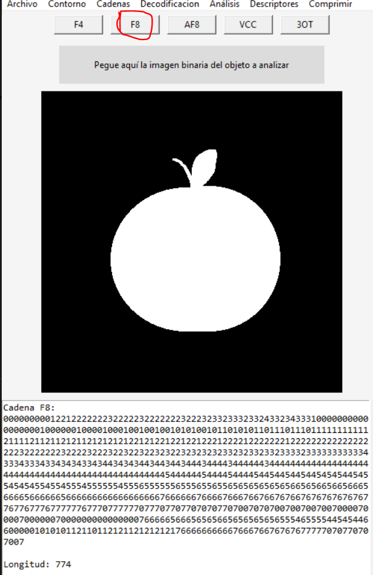{width="5.905555555555556in"
> height="9.084722222222222in"}

**Archivo**

(corresponde a la parte "1. Visualización de la Imagen")

Objetivo: Cargar imágenes binarias a la aplicación, cargar códigos de
cadena desde un .txt, o salir de la aplicación.

Descripción:

En el panel de control, hasta la izquierda, se encuentra el botoón
"Archivo".

Al darle clic podrá ver tres opciones:

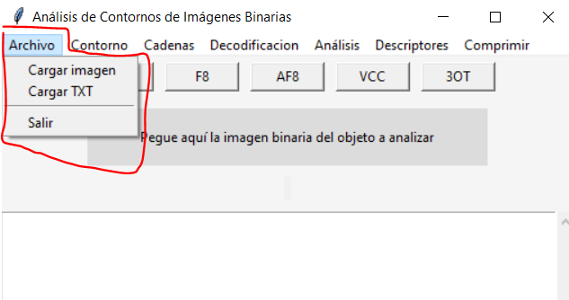{width="5.905555555555556in"
height="3.115972222222222in"}

1.  Cargar imagen, si selecciona esta opción se abrirá su explorador de
    archivos. La aplicación espera que usted seleccione desde su
    explorador de archivos una imagen binaria, una vez que se seleccione
    la aplicación procederá a cargar la imagen y colocarla dentro de la
    aplicación para su posterior análisis.

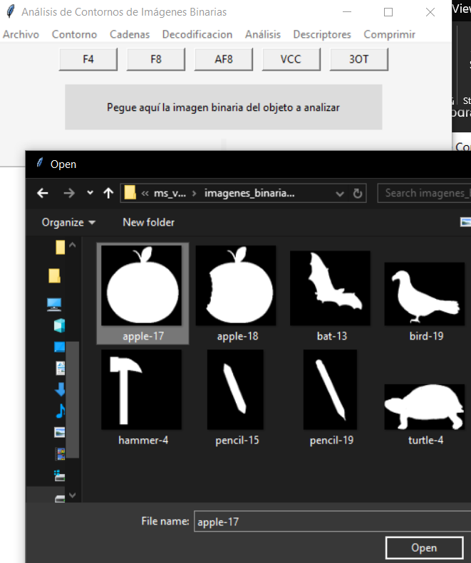{width="2.4941054243219596in"
height="2.9844794400699914in"}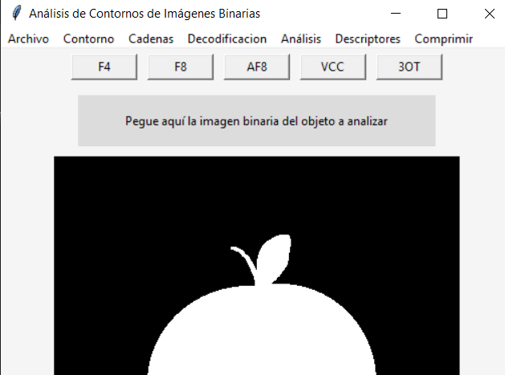{width="2.8776990376202973in"
height="2.1366174540682414in"}

2.  Cargar TXT, al seleccionar esta opción se abrirá su explorador de
    archivos. La aplicación espera que usted seleccione desde su
    explorador de archivos una archivo .txt que contenga la información
    de algún código de cadena, una vez que se seleccione la aplicación
    procederá a cargar el código de cadena y la colocará dentro de la
    aplicación en su espacio de texto para su posterior análisis.

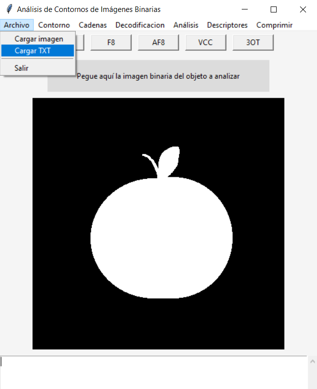{width="3.8656255468066494in"
height="4.747027559055118in"}

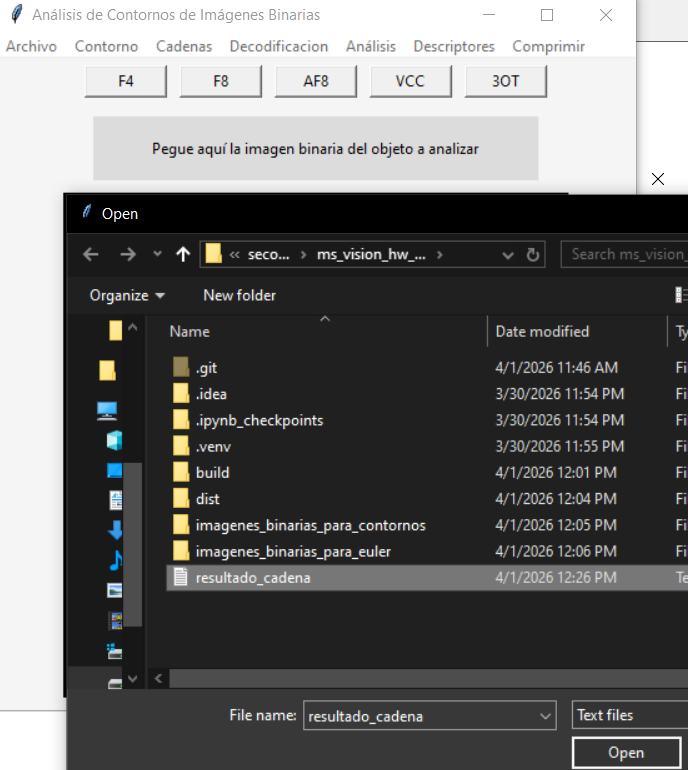{width="5.905555555555556in"
height="6.6097222222222225in"}

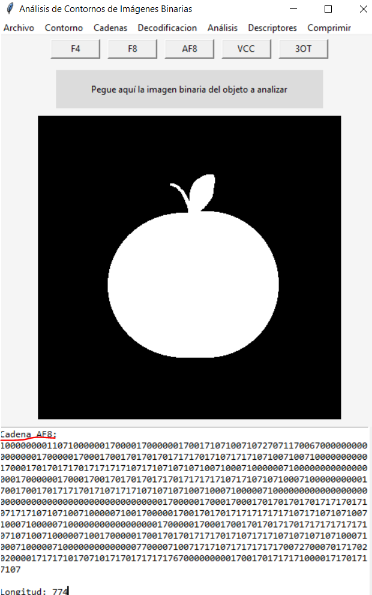{width="5.905555555555556in"
height="9.42986111111111in"}

3.  Salir, si se selecciona esta opción la aplicación se cierra
    completamente.

**Contorno**

(corresponde a una parte del punto las propiedades geométricas)

Objetivo: Mostrar el contorno del objeto binario encontrado, además de
mostrar con un punto verde el punto de inicio/partida.

Descripción: Dentro del panel de control se encontrará con el botón
"Contorno". Si lo selecciona se verá la opción de "Detectar contorno".
Es importante que se haya cargado previamente una imagen para poder
proceder al "Detectar contorno".

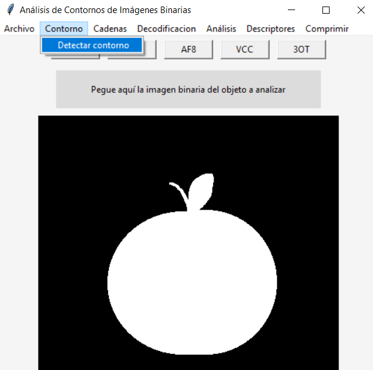{width="5.905555555555556in"
height="5.868055555555555in"}

Una vez que le dé en "Detectar contorno" se verá en la aplicación la
imagen binaria destacando en color rojo su contorno y con un punto verde
el sitio que los algoritmos usarán como punto de inicio/partida.

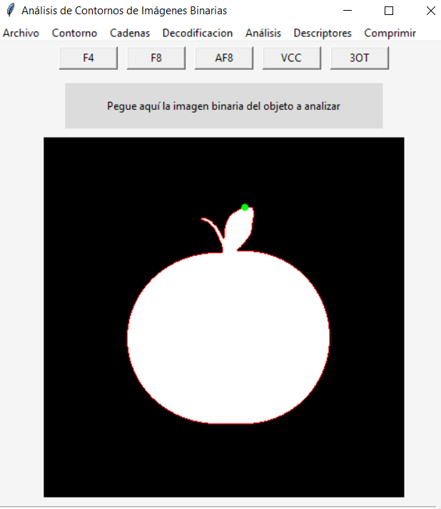{width="5.905555555555556in"
height="6.822916666666667in"}

**Cadenas**

(corresponde a la parte "2. Código de Cadena")

Objetivo: Calcular y desplegar los códigos de cadena y su longitud de
cadena según sea el algoritmo que se decida aplicar: F4, F8, AF8, VCC o
3OT. De igual forma tiene como objetivo poder guardar el código de
cadena en un archivo .txt.

Descripción: En el panel de control se verá el botón "Cadenas". Al darle
clic se verán las opciones que se pueden ejecutar (estas opciones solo
funcionarán si previamente se cargó una imagen binaria a la aplicación):

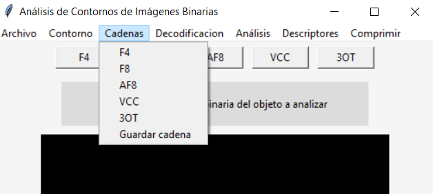{width="5.905555555555556in"
height="2.642361111111111in"}

- F4, calcula el código de cadena con el algoritmo F4. Se despliega el
  código de cadena en el cuadro de texto debajo de la imagen (para
  visualizarla por completo favor de maximizar la aplicación al tamaño
  completo de su pantalla).

- F8, calcula el código de cadena con el algoritmo F8. Se despliega el
  código de cadena en el cuadro de texto debajo de la imagen (para
  visualizarla por completo favor de maximizar la aplicación al tamaño
  completo de su pantalla).

- AF8, calcula el código de cadena con el algoritmo AF8. Se despliega el
  código de cadena en el cuadro de texto debajo de la imagen (para
  visualizarla por completo favor de maximizar la aplicación al tamaño
  completo de su pantalla).

- VCC, calcula el código de cadena con el algoritmo VCC. Se despliega el
  código de cadena en el cuadro de texto debajo de la imagen (para
  visualizarla por completo favor de maximizar la aplicación al tamaño
  completo de su pantalla).

- 3OT, calcula el código de cadena con el algoritmo 3OT. Se despliega el
  código de cadena en el cuadro de texto debajo de la imagen (para
  visualizarla por completo favor de maximizar la aplicación al tamaño
  completo de su pantalla).

- Guardar cadena, abre el explorador de archivos para que el usuario
  guarde el código de cadena como un archivo .txt en su disco local con
  el nombre que el usuario decida.

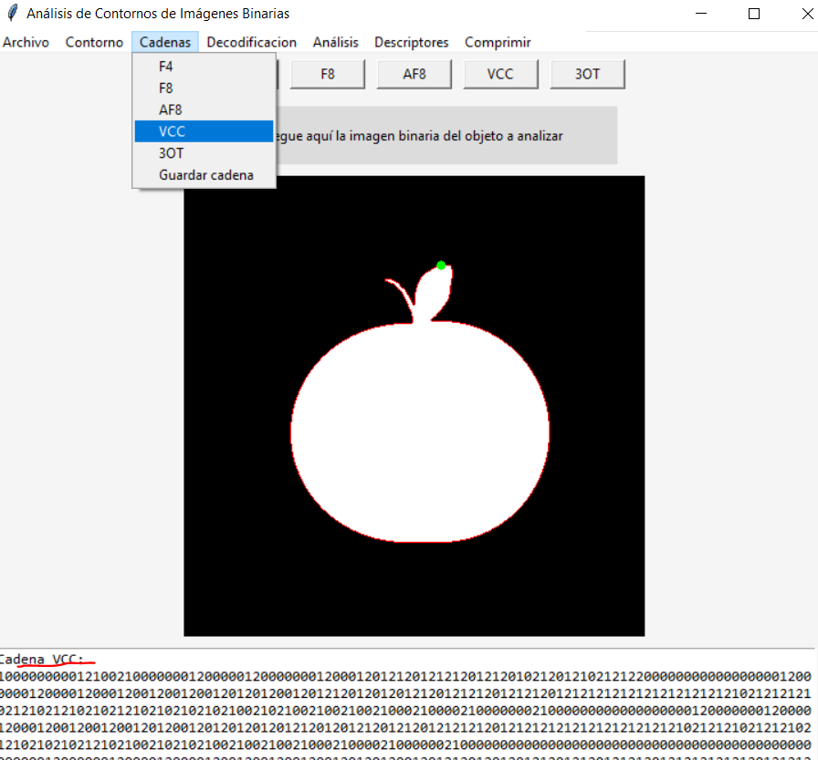{width="5.905555555555556in"
height="5.490277777777778in"}

**Decodificación**

(corresponde a la parte "3. Decodificación")

Objetivo:

Descripción:

**Análisis**

(corresponde a la parte "4. Histograma" y a la parte "5. Entropía de
Shannon")

Objetivo: Desplegar los histogramas correspondientes al código de cadena
que se seleccione y previamente se haya obtenido. Los histogramas
contienen: símbolo, frecuencia, probabilidad. También su objetivo es
desplegar el resultado de la entropía de Shannon según al código de
cadena obtenido y seleccionado.

Descripción: En el panel de control se encuentra el botón "Análisis".

Presenta este botón dos opciones que dependerán de los códigos de cadena
previamente calculados en la aplicación (se requiere que el usuario haya
obtenido previamente los códigos de cadena en la aplicación).

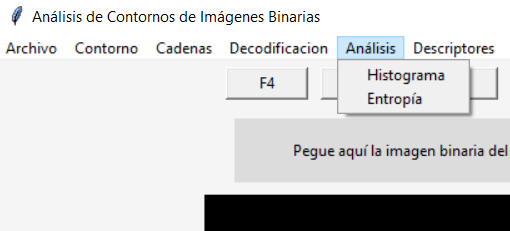{width="5.3125in" height="2.40625in"}

- Histograma

Al seleccionar este botón se abrirá una ventana externa que le pedirá al
usuario seleccionar el tipo de código de cadena del que quiere obtener
su histograma. Si el usuario no ha obtenido previamente un código de
cadena, entonces no se verá dentro de las opciones para obtener su
histograma.

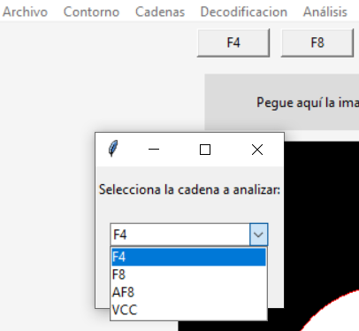{width="4.229166666666667in"
height="3.8958333333333335in"}

Al seleccionar el algoritmo se mostrará otra ventana emergente que
tendrá los resultados de su histograma. Se verán en un cuadro de texto
los símbolos, la frecuencia y su probabilidad.

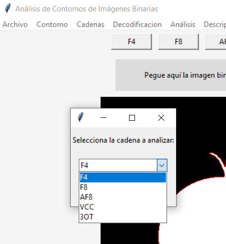{width="4.760416666666667in"
height="5.135416666666667in"}

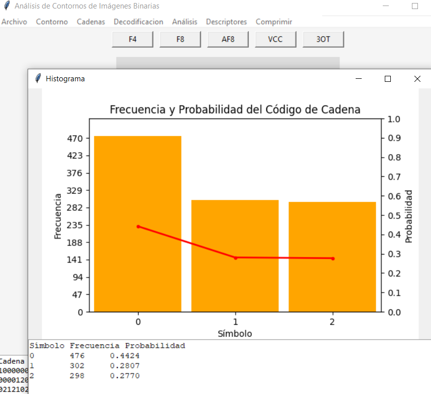{width="5.905555555555556in"
height="5.402777777777778in"}

- Entropía

Al seleccionar este botón se abrirá una ventana externa que le pedirá al
usuario seleccionar el tipo de código de cadena del que quiere calcular
su entropía. Si el usuario no ha obtenido previamente un código de
cadena, entonces no se verá dentro de las opciones.

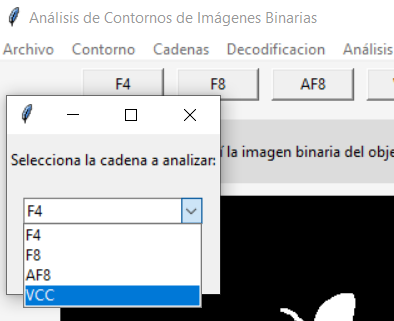{width="4.104166666666667in"
height="3.34375in"}

Al seleccionar el algoritmo se mostrará otra ventana emergente que
tendrá el resultado de la entropía de Shannon.

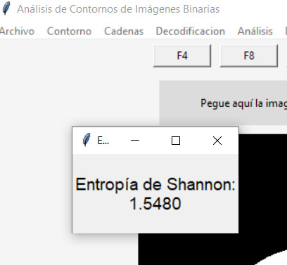{width="4.25in"
height="3.9270833333333335in"}

**Descriptores**

(corresponde a la parte "8. Propiedades Geométricas")

Objetivo: Proporcionar la información del perímetro, área, perímetro de
contacto, característica de Euler y compacidad discreta de la imagen
binaria.

Descripción: En el panel de control está presente el botón
"Descriptores". Al seleccionarlo se verá la opción de "Mostrar
propiedades".

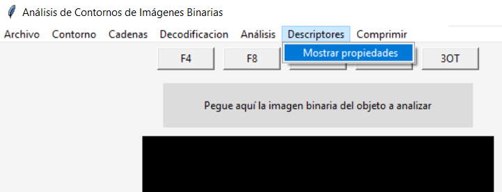{width="5.905555555555556in"
height="2.2604166666666665in"}

Cuando el usuario da clic en "Mostrar propiedades" se abrirá una nueva
ventana emergente que despliega todos los resultados de las propiedades
geométricas de nuestro objeto binario.

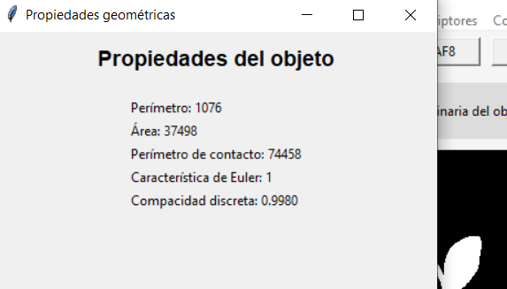{width="5.905555555555556in"
height="3.370138888888889in"}

**Comprimir**

(corresponde a la parte "6. Comprensión de Huffman" y a "7. Compresión
Aritmética")

Objetivo:

Descripción:

